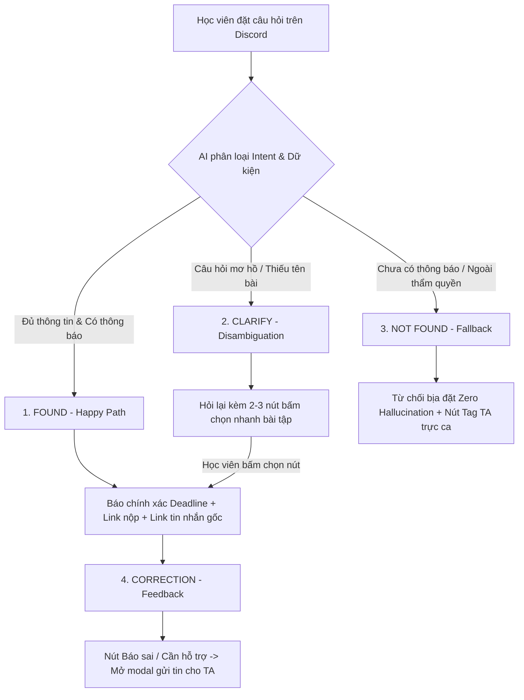

# 🎯 TÀI LIỆU HƯỚNG DẪN XÂY DỰNG PROTOTYPE (DÀNH CHO LAN ANH · SYSTEM & PROTOTYPE)

> **Dự án:** Discord Deadline & Logistics Guard · Nhóm Trustmebro (Lớp 3A · Phòng E403)  
> **Mục tiêu:** Hoàn thiện sản phẩm nộp **Checkpoint 2 (CP2) trước 21:00 ngày 16/9/2026**.  
> **Tiêu chí đạt CP2:** Luồng hoạt động **bấm được thông suốt (Clickable Prototype)**, thể hiện rõ ≥4 nguyên tắc HAX/PAIR, repo có commit hợp lệ. *(Chưa cần AI chạy thật, dữ liệu có thể mock chuẩn xác).*

---

## 📌 1. BẢN CHẤT LÁT CẮT & 4 ĐƯỜNG ĐI TRẢI NGHIỆM CẦN BẤM ĐƯỢC

### Lát cắt cốt lõi:
> *"Một học viên · hỏi hạn nộp bài trên Discord · AI bot phân loại intent và chỉ trích xuất câu trả lời từ thông báo chính thức, nếu thiếu thông tin sẽ từ chối bịa và tag TA trực ca · học viên nhận đúng deadline và không bị mất điểm oan do nộp trễ."*

### 4 Đường đi trải nghiệm (Bắt buộc phải bấm qua lại được):



---

## 🎨 2. CHI TIẾT 4 KỊCH BẢN MẪU & VỊ TRÍ GẮN NHÃN HAX/PAIR (R2 - 6 ĐIỂM)

Trên giao diện prototype, Lan Anh cần gắn các nhãn **HAX Badge** trực quan (ví dụ tag nhỏ màu xanh/vàng bên cạnh tin nhắn của bot) để giám khảo thấy ngay nhóm nắm chắc lý thuyết:

### Kịch bản 1: FOUND — Happy Path (Có nguồn chính thức)
* **User hỏi:** *"Hạn nộp Lab 2 lớp 3A khi nào thế bot?"*
* **Bot phản hồi:**
  > 📌 **Thông tin chính thức — Lab 2: Prompt Engineering**  
  > • **Hạn chót:** `23:59 · Thứ Năm, 17/9/2026` *(Còn 28 tiếng)*  
  > • **Link form nộp bài:** [https://forms.gle/lab2-submit](https://forms.gle/lab2-submit)  
  > • **Căn cứ xác thực:** [Thông báo #12 của Thầy Hoàng lúc 14:00 15/9 trong kênh `#announcements`](#)  
  > *(Nút bấm: [🔗 Mở Form Nộp] | [⚠️ Báo sai/Cần hỗ trợ])*
* **Nhãn HAX gắn kèm:**  
  - 🏷️ `HAX G1 (Làm rõ khả năng)`: Trả lời đúng phạm vi deadline/logistics.  
  - 🏷️ `HAX G2 (Minh bạch căn cứ)`: Trích dẫn rõ timestamp, người ra thông báo và link tin nhắn gốc.

---

### Kịch bản 2: CLARIFY — Disambiguation (Câu hỏi mơ hồ / Thiếu tên bài)
* **User hỏi:** *"Bao giờ phải nộp bài vậy mọi người?"*
* **Bot phản hồi:**
  > ❓ Bạn đang muốn tra cứu hạn nộp của bài tập nào dưới đây?  
  > *Vui lòng bấm chọn để xem thông tin chính thức:*  
  > `[📘 Lab 2 (Hạn 17/9)]` `[📝 Quiz 1 (Hạn 19/9)]` `[🏆 Mini-Hackathon (Hạn 18/9)]`
* **Tương tác bấm được:** Khi click vào nút `[📘 Lab 2 (Hạn 17/9)]`, khung chat tự động hiển thị chi tiết hạn chót của Lab 2 như Kịch bản 1.
* **Nhãn HAX gắn kèm:**  
  - 🏷️ `HAX G10 (Thu hẹp phạm vi khi nghi ngờ)`: Không tự đoán mò ý học viên mà chủ động đưa lựa chọn để thu hẹp phạm vi.

---

### Kịch bản 3: NOT FOUND / OUT OF SCOPE — Fallback an toàn (Zero Hallucination)
* **Tình huống A (Bài chưa có thông báo):**
  * **User hỏi:** *"Hạn nộp bài Capstone Project cuối kỳ là khi nào?"*
  * **Bot phản hồi:**
    > ⚠️ **Chưa có thông báo chính thức:**  
    > Hiện tại BTC chưa công bố hạn chót cho *Capstone Project*.  
    > Để tránh gây nhầm lẫn hoặc rủi ro mất điểm, bot từ chối suy đoán ngày giờ. Vui lòng theo dõi kênh `#announcements` hoặc nhờ TA trực ca xác nhận.  
    > *(Nút bấm: [🛎️ Tag TA trực ca hỗ trợ])*
* **Tình huống B (Hỏi ngoài thẩm quyền):**
  * **User hỏi:** *"Bot ơi điểm danh hộ mình buổi hôm nay với"*
  * **Bot phản hồi:**
    > 🚫 **Ngoài phạm vi hỗ trợ:**  
    > Bot không có quyền hạn can thiệp vào hệ thống điểm danh. Bạn vui lòng quét mã QR tại lớp hoặc liên hệ trực tiếp Giảng viên/TA nhé!
* **Nhãn HAX gắn kèm:**  
  - 🏷️ `HAX G1 (Nêu rõ giới hạn hệ thống)`  
  - 🏷️ `HAX G8 (Hỗ trợ gạt bỏ dễ dàng / Kích hoạt Fallback tag con người)`.

---

### Kịch bản 4: CORRECTION — Feedback Loop (Vòng lặp người dùng sửa sai)
* **Tương tác:** Dưới mỗi câu trả lời của Bot luôn có nút `[⚠️ Báo sai / Cần hỗ trợ]`.
* **Khi học viên bấm vào:** Mở một hộp thoại nhỏ (Modal) hoặc bot phản hồi:
  > *"Cảm ơn bạn đã phản hồi. Bot đã ghi nhận và gắn cờ (flag) tin nhắn này tới TA trực ca `@NguyenVanA`. TA sẽ kiểm tra và đính chính trong ít phút!"*
* **Nguyên tắc PAIR:** Hỗ trợ vòng phản hồi sửa sai (Feedback & Error Recovery).

---

## 🛠️ 3. DỮ LIỆU NGUỒN SỰ THẬT (MOCK DATABASE DÙNG CHO PROTOTYPE)

Lan Anh có thể dùng trực tiếp bảng dữ liệu mẫu sau để nạp vào giao diện prototype:

```json
[
  {
    "id": "lab-2",
    "name": "Lab 2: Prompt Engineering & LLM Basics",
    "deadline": "23:59 · Thứ Năm, 17/9/2026",
    "form_url": "https://forms.gle/lab2-submit-k4",
    "format": "File notebook .ipynb hoặc link GitHub public",
    "source_channel": "#announcements",
    "source_title": "Thông báo số 12 của GV hướng dẫn",
    "source_time": "14:00 ngày 15/9/2026",
    "status": "active"
  },
  {
    "id": "quiz-1",
    "name": "Quiz 1: Kiến trúc Transformer & Tokenization",
    "deadline": "21:00 · Thứ Bảy, 19/9/2026",
    "form_url": "https://vlearn.edu.vn/courses/ai-k4/quiz-1",
    "format": "Làm trắc nghiệm trực tiếp trên VLearn (thời gian làm bài 30 phút)",
    "source_channel": "#announcements",
    "source_title": "Thông báo mở cổng Quiz 1",
    "source_time": "09:00 ngày 14/9/2026",
    "status": "active"
  },
  {
    "id": "hackathon-cp2",
    "name": "Mini Hackathon - Checkpoint 2 (Luồng bấm được)",
    "deadline": "21:00 · Thứ Tư, 16/9/2026",
    "form_url": "https://forms.gle/hackathon-cp2-submit",
    "format": "Link GitHub repo public + Video demo bấm được",
    "source_channel": "#announcements",
    "source_title": "Quy chế Mini Hackathon AI Batch 04",
    "source_time": "18:00 ngày 16/9/2026",
    "status": "active"
  }
]
```

---

## 💻 4. LỰA CHỌN CÔNG NGHỆ THỰC HIỆN NHANH (TRƯỚC 21:00)

Để kịp nộp CP2 trước 21:00, Lan Anh có 2 cách làm nhanh và hiệu quả nhất:

### ⭐ Cách 1: Web Prototype độc lập trong thư mục `codebase/` (Khuyên dùng - Rất nhanh & Dễ demo)
- Tạo 3 file: `codebase/index.html`, `codebase/style.css`, `codebase/app.js`.
- Giao diện thiết kế theo phong cách Discord Dark Mode:
  - Cột trái: Kênh chat `#hoi-dap-logistics`, `#announcements`.
  - Khung giữa: Khung chat mô phỏng với tin nhắn học viên + tin nhắn bot + các nút bấm tương tác.
  - Cột phải: **Bảng điều khiển Giám khảo (HAX Inspector)** gồm 4 nút bấm chạy nhanh 4 kịch bản (Scenario 1, 2, 3, 4) để khi quay video màn hình chỉ mất 30 giây là trình diễn xong toàn bộ luồng!
- Lan Anh có thể tự do xây dựng các file giao diện trong thư mục `codebase/` bằng HTML/CSS/JS tĩnh hoặc framework tuỳ chọn.

### Cách 2: Thiết kế Mockup Figma tương tác
- Nếu Lan Anh làm bằng Figma, cần đảm bảo link Figma bật chế độ **Anyone with the link can view**, bấm qua lại được cả 4 kịch bản trên bằng Smart Animate/Prototyping.

---

## 📹 5. CHECKLIST KIỂM TRA TRƯỚC KHI NỘP CP2 (HẠN: 21:00)

- [ ] Bấm thử Luồng 1 (Happy path): Bot trả lời đúng hạn Lab 2 kèm trích dẫn nguồn.
- [ ] Bấm thử Luồng 2 (Clarify): Hỏi mơ hồ -> Hiện 3 nút chọn bài -> Bấm nút ra kết quả.
- [ ] Bấm thử Luồng 3 (Not found): Hỏi bài chưa có nguồn -> Bot từ chối bịa + có nút Tag TA.
- [ ] Bấm thử Luồng 4 (Feedback): Bấm nút Báo sai -> Hiện xác nhận đã báo cho TA.
- [ ] Các nhãn `HAX G1`, `HAX G2`, `HAX G8`, `HAX G10` hiển thị rõ ràng trên giao diện.
- [ ] Đội trưởng Xuân Dũng thực hiện `git add .`, `git commit` và `git push origin main`.
- [ ] Quay 1 video màn hình 30-45 giây thao tác bấm 4 luồng để nộp kèm form CP2.
