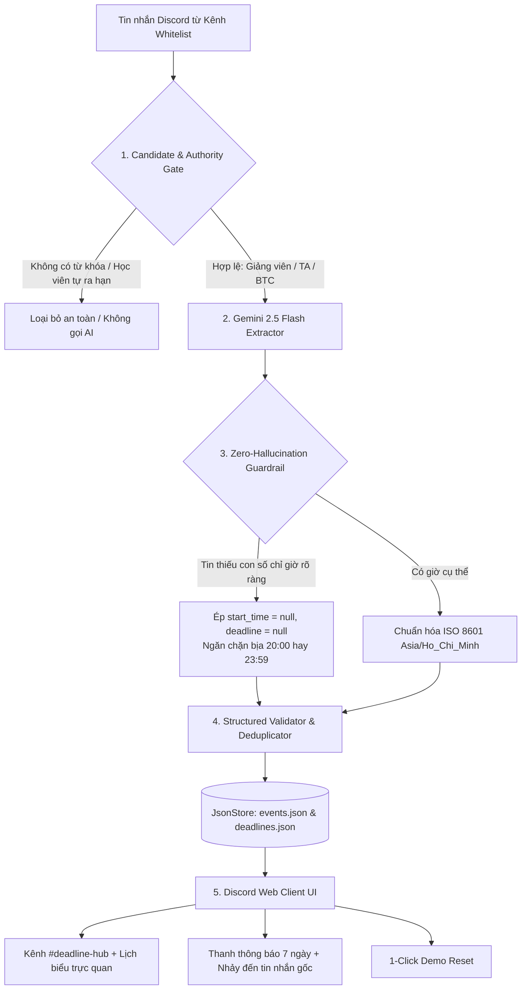

# K4-3A-E403-Trustmebro — Discord Deadline & Logistics Guard

> **Sự kiện:** Mini Hackathon AI Batch 04 · Lớp 3A · Phòng E403  
> **Thời lượng:** 47,5 giờ (Từ 18:00 ngày 16/9 đến 17:30 ngày 18/9/2026)  
> **Tên nhóm:** Trustmebro | **Phòng:** E403 | **Lớp:** 3A  
> **Đề tài:** **Track B1 — Tối ưu Trợ lý Học viên Discord (Deadline & Logistics Guard)**  
> **Repo GitHub:** [https://github.com/luuxuandung04/K4-3A-E403-TrustmeBro](https://github.com/luuxuandung04/K4-3A-E403-TrustmeBro)  
> **Trạng thái:** ✅ **21/21 Unit Tests PASS (100%)** | 🛡️ **Zero-Hallucination Guardrails Active**

---

## 👥 1. THÀNH VIÊN & PHÂN CÔNG VAI TRÒ (4 THÀNH VIÊN)

| Họ và Tên | Mã Sinh Viên | GitHub Username | Vai trò chính | Phần việc đảm nhiệm cụ thể trong dự án |
|---|---|---|---|---|
| **Lưu Xuân Dũng** *(Đội trưởng)* | **2A202602746** | `luuxuandung04` | **Team Lead · AI Engineer** | • Nộp form cả 5 checkpoint bằng mã SV `2A202602746` đúng hạn.<br>• Quản trị Repo GitHub, Git Flow, CI/CD và Clean Code.<br>• Thiết kế Prompt hệ thống, Pipeline RAG, Zero-Hallucination Guardrails và cơ chế Fallback.<br>• Thuyết trình chính tại CP6 và điều phối trả lời Q&A Thẻ giám khảo. |
| **Trương Thị Lan Anh** | **2A202602451** | `SxAinsworth` | **System · Prototype** | • Xây dựng Discord Web Client (`codebase/`) tương tác thời gian thực với FastAPI.<br>• Tích hợp thanh thông báo 7 ngày, nhảy trực tiếp tới tin nhắn gốc và kênh chat tương ứng.<br>• Thể hiện trực quan các điểm chạm HAX/PAIR (G1, G2, G9, G10, G11) và nút Reset Demo 1-Click.<br>• Thiết kế Slide 6 trang PDF (`demo-slides.pdf`) chuẩn rubric CP5. |
| **Nguyễn Duy Khánh** | **2A202602736** | `nguyenkhanhbh01989` | **Product · UX/UI · Spec** | • Phân tích số liệu khảo sát học viên ($N = 21$), trích xuất bằng chứng định lượng & định tính (R1).<br>• Thiết kế định dạng hiển thị thông tin chuẩn của Bot và hoàn thiện tài liệu `spec.md` 9 phần.<br>• Điều phối quy trình thử nghiệm người dùng ngoài nhóm 5 nhịp (R6 bonus +8đ). |
| **Tạ Quang Dũng** | **2A202602588** | `taquangdung123` | **Data · QA · Golden Set** | • Thu thập và chuẩn hóa dữ liệu thông báo từ các kênh whitelist (`announcements`, `hackathon`...).<br>• Xây dựng bộ test case Golden Set (35 cases) phủ 4 lớp chỗ khó (R4).<br>• Lập trình script đo kiểm tự động (`eval/run_eval.py`), đối chiếu và báo cáo Quality Bar. |

---

## 🚀 2. HƯỚNG DẪN CÀI ĐẶT MÔI TRƯỜNG & KHỞI CHẠY (DÀNH CHO THÀNH VIÊN)

Phần này hướng dẫn chi tiết từng bước để mọi thành viên trong nhóm clone repo, thiết lập môi trường Python, cấu hình API key và khởi chạy toàn bộ hệ thống trên máy cá nhân.

### Bước 1: Yêu cầu Tiên Quyết
- **Python**: Phiên bản `>= 3.10` (Khuyến nghị 3.10 hoặc 3.11).
- **Git**: Đã cài đặt trên máy.
- **Trình duyệt Web**: Google Chrome, Microsoft Edge hoặc Mozilla Firefox.

### Bước 2: Clone Repo & Mở Thư Mục
```powershell
# Clone mã nguồn từ GitHub
git clone https://github.com/luuxuandung04/K4-3A-E403-TrustmeBro.git

# Di chuyển vào thư mục dự án
cd K4-3A-E403-TrustmeBro
```

### Bước 3: Tạo & Kích Hoạt Môi Trường Ảo (Virtual Environment)
```powershell
# 1. Tạo môi trường ảo .venv
python -m venv .venv

# 2. Kích hoạt môi trường ảo:
# Trên Windows PowerShell:
.\.venv\Scripts\Activate.ps1
# (Nếu gặp lỗi Execution Policy trên PowerShell, chạy lệnh: Set-ExecutionPolicy -Scope Process -ExecutionPolicy Bypass)

# Trên Windows Command Prompt (cmd):
.\.venv\Scripts\activate.bat

# Trên macOS / Linux:
source .venv/bin/activate
```

### Bước 4: Cài Đặt Các Gói Phụ Thuộc (Dependencies)
```powershell
python -m pip install --upgrade pip
pip install -r requirements.txt
```

### Bước 5: Cấu Hình Biến Môi Trường (.env) & Gemini API Key
1. Sao chép tệp mẫu `.env.example` thành `.env`:
   ```powershell
   # Trên Windows:
   copy .env.example .env

   # Trên macOS / Linux:
   cp .env.example .env
   ```
2. Mở tệp `.env` vừa tạo và dán khóa API của bạn:
   ```env
   # Lấy API Key miễn phí tại: https://aistudio.google.com/app/apikey
   GEMINI_API_KEY=AIzaSy...your_gemini_api_key_here
   GEMINI_MODEL=gemini-2.5-flash
   HOST=127.0.0.1
   PORT=8000
   TIMEZONE=Asia/Ho_Chi_Minh
   ```
> [!NOTE]
> **Cơ chế Chống Lỗi (Quota Resilience):** Nếu bạn chưa có API Key hoặc tài khoản đạt giới hạn 20 req/ngày (HTTP 429 Quota Exceeded), hệ thống sẽ **tự động kích hoạt cơ chế Rule/Regex Fallback**. Giao diện sẽ hiển thị Toast cảnh báo màu vàng và ghi log chi tiết mà không làm gián đoạn trải nghiệm người dùng!

### Bước 6: Khởi Chạy Hệ Thống
Bạn có thể chọn một trong hai cách khởi chạy:

- **Cách 1 (Nhanh nhất trên Windows):**
  Nhấp đúp chuột vào tệp `start_server.bat` trong thư mục gốc.

- **Cách 2 (Khởi chạy bằng lệnh Uvicorn):**
  ```powershell
  python -m uvicorn backend.main:app --host 127.0.0.1 --port 8000 --reload
  ```

Sau khi server khởi động thành công, mở trình duyệt và truy cập:
👉 **`http://127.0.0.1:8000`**

---

## 🛠️ 3. CÁC LỆNH TIỆN ÍCH PHỤC VỤ KIỂM THỬ & DEMO

### 1. Dọn rác & Khôi phục dữ liệu Demo chuẩn (1-Click Demo Reset)
Sau nhiều lần thử nghiệm gửi tin nhắn chat, dữ liệu có thể bị xáo trộn. Bạn có thể khôi phục lại trạng thái ban đầu sạch đẹp bằng:
- **Cách 1:** Nhấp vào nút **`[🧹 Dọn rác / Reset Demo]`** ngay trên thanh menu trên cùng của giao diện web.
- **Cách 2 (Dòng lệnh CLI):**
  ```powershell
  python scripts/reset_demo_data.py
  ```

### 2. Chạy Toàn Bộ Kiểm Thử Tự Động (Unit Tests)
Dự án được bảo vệ bằng 21 bài kiểm thử tự động (kiểm tra phân quyền tác giả, phát hiện bịa giờ, quy đổi ngày, deduplication):
```powershell
pytest backend/tests/
```
*(Kết quả chuẩn: 21 passed in ~1-2s khi dùng fallback mock hoặc ~30-40s khi test network live)*.

### 3. Mô Phỏng Từng Bước Pipeline AI (Dành Cho Giám Khảo & Thuyết Trình)
Để trình diễn trực quan cho Ban giám khảo cách tin nhắn thô đi qua từng cổng lọc:
```powershell
python run_pipeline_steps.py
```
Script sẽ cho phép chọn tin nhắn mẫu và in ra kết quả từng bước: `Raw Input` → `Candidate Gate` → `Semantic Extractor` → `Validator` → `Event Document`.

### 4. Chạy Đo Kiểm Bộ Golden Set (Quality Bar)
```powershell
python -m eval.run_eval
```

---

## 🏗️ 4. KIẾN TRÚC HỆ THỐNG & CƠ CHẾ BẢO VỆ DỮ LIỆU



### 4 Chốt chặn bảo vệ cốt lõi:
1. **Phân quyền nguồn tin (Authority Filtering):** Tin nhắn từ học viên (`student`) không bao giờ được phép tự ý ban hành hoặc cập nhật hạn nộp chính thức.
2. **Triệt tiêu ảo giác thời gian (Zero-Hallucination Time Guard):** Khi tin nhắn nói chung chung (*"tối nay họp nhé"*, *"mai nộp bài"*), AI bị nghiêm cấm tự bịa giờ mặc định (như 20:00). Trường hợp này hạ về thông báo thường (P2) và không tạo deadline ảo trên lịch.
3. **Cơ chế nhảy trực tiếp đến tin nhắn gốc:** Trên thanh thông báo 7 ngày, khi học viên bấm vào nguồn hoặc mã tin nhắn, giao diện sẽ tự động chuyển đúng kênh và cuộn mượt mà đến đúng vị trí tin nhắn gốc đã được đánh dấu màu.
4. **Cơ chế dự phòng API (Fallback Resilience):** Bắt trọn mã lỗi `429 ResourceExhausted` của Gemini API, tự động kích hoạt Rule Extractor và cảnh báo minh bạch trên giao diện theo đúng nguyên tắc **Google PAIR / Microsoft HAX G2**.

---

## 📋 5. CANVAS 4 Ô — CHECKPOINT 1

### 🟩 01 · Người dùng & Nỗi đau
* **Đối tượng:** Học viên các khóa học AI / Công nghệ tại VinUni đang làm bài Lab, Quiz, Assignment và Capstone Project trên Discord.
* **Nỗi đau thực tế:**
  - Thông báo quan trọng trôi rất nhanh giữa hàng trăm tin chat; thiếu trang tổng hợp cố định.
  - Bot hỏi đáp cũ thiếu tin cậy: hay bịa barem điểm, bịa quy định tính XP hoặc cung cấp form đã hết hạn.
  - **61.9%** học viên mất từ 5 đến hơn 15 phút để tìm thông tin; **71.4%** chịu ảnh hưởng tiêu cực (hoang mang, nộp sát giờ, nộp muộn).

### 🟦 02 · Bằng chứng khảo sát ($N = 21$)
* **47.6%** tìm bằng từ khóa trên Discord nhưng bị ngợp giữa kết quả rác.
* **52.4%** nhận kết quả thất bại ở lần gần nhất hỏi bot.
* **61.9%** từng gặp sự cố trực tiếp vì bot (38.1% sai link, 38.1% bịa điểm).
* **Trích dẫn thực tế:** *"Hỏi bot thì bot tự chế ra barem điểm không hề có trên lớp làm mình hoảng loạn... Rào cản lớn nhất là thông tin nằm rải rác mỗi nơi một mẩu và không có trang tổng hợp chuẩn xác."*

### 🟪 03 · Lát cắt & Tự động hóa
* **Lát cắt MỘT CÂU:**  
  > *Nhiều kênh thông báo → Một quyết định AI có căn cứ → Một lịch deadline chung dễ theo dõi.*
* **Mức tự động hóa:** `Augment + Conditional automation` (Bot chỉ tự công bố khi đủ căn cứ từ nguồn chính thức; trường hợp mơ hồ hoặc có báo sai dừng lại cho TA/Giảng viên quyết định cuối cùng).

### 🟧 04 · Người thử & Phân công
* **Willing Users:** Tối thiểu 2 học viên ngoài nhóm trong phòng E403 tham gia thử nghiệm tại CP5.

---

## ⏰ 6. TIẾN ĐỘ 6 CHECKPOINTS

- [x] **CP1 (19:30 · 16/9):** Nộp Form CP1 (Canvas 4 ô, Repo Public, Khai báo 2 Willing users).
- [x] **CP2 (21:00 · 16/9):** Working Mock `#deadline-hub` + calendar bấm thông suốt 4 luồng; đã chuẩn hóa HAX/PAIR.
- [x] **CP3 (16:00 · 17/9):** Video 30s AI chạy thật + Bảng đo lượt 1 trên Golden Set 20 case qua NVIDIA NIM: **19 PASS / 1 FAIL = 95%, 0 case bịa deadline**.
- [x] **CP4 (21:00 · 17/9):** Chốt spec.md hoàn chỉnh + Khóa Quality Bar **≥85%, 0% bịa/sai deadline**; công khai phần chưa hoàn thành.
- [x] **Hoàn thiện Backend & Frontend Pipeline (Đêm 17/9):** FastAPI kết nối trực tiếp Discord Web Client, Zero-Hallucination Regex Guardrails, Authority Whitelist Gate, Quota Logging, 1-Click Demo Reset, 21/21 unit tests PASS.
- [ ] **CP5 (13:00 · 18/9):** `demo-slides.pdf` 6 trang + Video demo dự phòng + Nhật ký `validation/user_test_log.md`.
- [ ] **CP6 (17:30 · 18/9):** Thuyết trình Vòng cụm E403 (6 phút) & Chung kết (10 phút: 7' pitch + 3' Q&A Thẻ giám khảo).

---

## 📁 7. CẤU TRÚC THƯ MỤC DỰ ÁN

```text
K4-3A-E403-Trustmebro/
├── .env.example               # File mẫu cấu hình biến môi trường và API Key
├── .gitignore                  # Cấu hình loại trừ file nhạy cảm và file rác Git
├── README.md                   # Tài liệu tổng quan dự án & hướng dẫn thành viên
├── spec.md                     # Bản đặc tả kỹ thuật AI hoàn chỉnh 9 phần
├── requirements.txt            # Danh sách thư viện Python phụ thuộc
├── start_server.bat            # File batch 1-click khởi chạy FastAPI Server
├── run_pipeline_steps.py       # CLI demo từng bước xử lý pipeline cho giám khảo
│
├── backend/                    # Mã nguồn máy chủ FastAPI & Pipeline AI
│   ├── main.py                 # Điểm khởi động FastAPI server & API endpoints
│   ├── config.py               # Quản lý cấu hình, whitelist kênh và tác giả
│   ├── db/                     # Cơ sở dữ liệu JSON Store (ghi atomic an toàn)
│   │   └── json_store.py
│   ├── models/                 # Pydantic Schemas (DiscordRaw, AI-IO, EventDoc)
│   ├── services/               # Bộ dịch vụ xử lý pipeline
│   │   ├── filter_router.py    # Authority & Candidate Gate
│   │   ├── ai_extractor.py     # Gemini 2.5 Flash + Zero-Hallucination Guard
│   │   ├── validator.py        # Kiểm tra tính toàn vẹn và mức ưu tiên P1/P2/P3
│   │   ├── policy_engine.py    # Xử lý xung đột & phân loại AUTO/REVIEW/REJECT
│   │   ├── pipeline_logger.py  # Ghi log kiểm toán có cấu trúc và cảnh báo Quota
│   │   └── demo_reset.py       # Logic dọn rác và khôi phục dữ liệu Demo chuẩn
│   └── tests/                  # Bộ kiểm thử tự động (21 test cases - 100% PASS)
│
├── codebase/                   # Giao diện Discord Web Client
│   ├── README.md               # Hướng dẫn chi tiết về giao diện người dùng
│   ├── index.html              # Cấu trúc giao diện Discord
│   ├── style.css               # Giao diện Discord Dark Theme
│   └── app.js                  # Logic tương tác client & gọi API FastAPI
│
├── data/                       # Dữ liệu nguồn và sự kiện đã bóc tách
│   ├── channels/               # Tin nhắn từng kênh chat (.json)
│   ├── deadlines.json          # Danh sách deadline đã công bố
│   └── events.json             # Cơ sở dữ liệu sự kiện đầy đủ
│
├── eval/                       # Bộ kiểm thử Golden Set & đo kiểm chất lượng
│   ├── golden_set.json         # 35 test cases phức tạp phủ 4 lớp chỗ khó
│   ├── run_eval.py             # Script tự động đo kiểm độ chính xác
│   └── run_results.md          # Báo cáo kết quả các lượt đo
│
├── evidence/                   # Bằng chứng khảo sát người dùng
│   └── survey-method.md        # Phương pháp và phân tích khảo sát N=21
├── validation/                 # Nhật ký thử nghiệm người dùng (Bonus R6)
│   └── user_test_log.md
├── reflection/                 # Bài suy ngẫm cá nhân của 4 thành viên
└── scripts/                    # Scripts tiện ích dòng lệnh
    └── reset_demo_data.py      # Script CLI dọn rác và reset demo chuẩn
```
