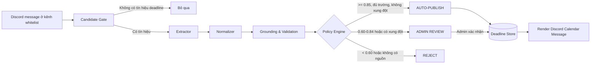

# SYSTEM LOGIC — Deadline Bot chạy hoàn toàn trong Discord

## 1. Quyết định sản phẩm

Calendar không phải một website riêng. Người dùng thao tác bằng slash command trong `#deadline-hub`; bot trả về một message calendar có nút bấm và cập nhật chính message đó.

Luồng chính:

`/deadline tong-hop` → bot quét dữ liệu đã thu thập → policy engine phân loại → bot trả calendar bằng Discord Components → người dùng bấm tháng/chi tiết/báo sai ngay trong Discord.

> **Ràng buộc UI thật của Discord:** Discord không cho bot nhúng HTML/CSS tuỳ ý vào message. Bản triển khai thật dùng Components V2: calendar tháng là `Text Display` dạng lưới monospace, từng deadline là `Section`, và điều hướng là `Button/Action Row`; form thêm/sửa dùng `Modal`. Prototype web đang mô phỏng bố cục native này, không đại diện cho một website được mở bên trong Discord.

## 2. Admin có phải nhập tay không?

Không. Hệ thống dùng mô hình **hybrid**:

1. **Tự nhận diện (mặc định):** bot chỉ đọc các kênh nguồn được whitelist như `#announcements`, `#lab-assignments`, `#quiz-updates`, `#hackathon`.
2. **Message command (an toàn nhất):** admin bấm chuột phải vào một thông báo chính thức → `Apps` → `Tạo deadline`. Bot lấy đúng message đó làm nguồn và mở form xác nhận phần đã trích xuất.
3. **Nhập tay (fallback):** `/deadline them` mở modal khi deadline được thông báo bằng lời nói, ảnh hoặc nguồn mà bot không đọc được.

Admin không nhập lại mọi deadline; admin chỉ duyệt mục mơ hồ/xung đột và xử lý ngoại lệ.

## 3. Pipeline nhận diện deadline



### Bước A — Candidate Gate

Dùng rule rẻ và dễ kiểm soát trước khi gọi AI:

- Từ khóa: `deadline`, `hạn nộp`, `nộp trước`, `đóng form`, `gia hạn`, `due`.
- Có biểu thức ngày/giờ: `17/09`, `thứ Sáu`, `23:59`, `<t:...>`.
- Hoặc message do role GV/TA đăng trong kênh whitelist.

Message không qua gate sẽ không gọi model, giảm chi phí và false positive.

### Bước B — Structured Extractor

AI chỉ được phép trả JSON theo schema, không trả văn xuôi:

```json
{
  "title": "Lab 2 · Prompt Engineering",
  "due_at_local": "2026-09-17T23:59:00+07:00",
  "timezone": "Asia/Ho_Chi_Minh",
  "course": "AI Batch 04",
  "cohort": "Lớp 3A",
  "submission_target": "Google Form",
  "source_message_id": "discord_snowflake",
  "source_channel_id": "discord_snowflake",
  "is_extension": true,
  "missing_fields": [],
  "extractor_confidence": 0.94
}
```

Nếu không tìm thấy ngày/giờ, model phải trả `null` và liệt kê trong `missing_fields`; tuyệt đối không được đoán.

### Bước C — Normalizer

- Quy đổi “thứ Sáu”, “ngày mai”, “cuối tuần” dựa trên timestamp của message.
- Chuẩn hoá múi giờ bắt buộc: `Asia/Ho_Chi_Minh`.
- Lưu cả UTC để so sánh và timestamp Discord `<t:unix:F>` để mỗi client hiển thị đúng giờ.
- Chuẩn hoá tên bài để gộp `Lab02`, `Lab 2`, `Bài lab số 2` thành một entity.

### Bước D — Grounding & Validation

Kiểm tra bằng code/rule, không giao toàn bộ cho LLM:

- Message có thật và bot còn đọc được.
- Channel nằm trong whitelist.
- Tác giả có role GV/TA hoặc nguồn đã được admin phê duyệt.
- `due_at` ở tương lai, có ngày và giờ cụ thể.
- So sánh với deadline hiện có để phát hiện bản trùng/gia hạn/xung đột.
- Bản gia hạn chỉ ghi đè khi nguồn mới hơn và có độ tin cậy không thấp hơn nguồn cũ.

### Bước E — Confidence + Policy Engine

Điểm minh hoạ, tính bằng rule có thể audit:

| Tín hiệu | Điểm |
|---|---:|
| Tác giả có role GV/TA | +0.25 |
| Kênh thuộc whitelist | +0.20 |
| Có ngày tuyệt đối | +0.20 |
| Có giờ cụ thể | +0.15 |
| Có tên bài rõ | +0.10 |
| Có lớp/môn rõ | +0.05 |
| Có nơi nộp | +0.05 |
| Xung đột với nguồn còn hiệu lực | −0.35 |

- `>= 0.85` + đủ trường bắt buộc + không xung đột → `AUTO_PUBLISHED`.
- `0.60–0.84`, thiếu trường hoặc xung đột → `NEEDS_REVIEW`.
- `< 0.60` hoặc không có grounding → `REJECTED`.

LLM chỉ trích xuất; **policy engine bằng code mới có quyền công bố**.

## 4. Slash commands và quyền

| Lệnh / thao tác | Ai dùng | Kết quả |
|---|---|---|
| `/deadline tong-hop [pham_vi]` | Mọi thành viên | Trả calendar và danh sách deadline có căn cứ |
| `/deadline xem [thang]` | Mọi thành viên | Mở calendar đã lưu, không quét lại nguồn |
| Nút `Chi tiết` | Mọi thành viên | Hiện nguồn, timestamp và confidence |
| Nút `Báo sai` | Mọi thành viên | Gắn `UNDER_REVIEW`, gửi admin |
| `/deadline dong-bo` | Admin/TA | Quét lại các kênh whitelist |
| Message command `Tạo deadline` | Admin/TA | Trích xuất từ đúng message được chọn |
| `/deadline them` | Admin/TA | Modal nhập tay có audit log |
| `/deadline duyet` | Admin/TA | Duyệt/từ chối candidate mơ hồ |

## 5. Dữ liệu tối thiểu

### `deadline`

`id`, `guild_id`, `title`, `due_at_utc`, `timezone`, `course`, `cohort`, `status`, `confidence`, `created_at`, `updated_at`.

### `deadline_source`

`deadline_id`, `message_id`, `channel_id`, `author_id`, `message_timestamp`, `source_text_hash`, `is_official`.

### `review_action`

`deadline_id`, `actor_id`, `action`, `reason`, `before_json`, `after_json`, `created_at`.

Mọi sửa đổi đều lưu audit log; không xoá dấu vết nguồn cũ.

## 6. Logic cập nhật calendar message

- Mỗi lớp có một `calendar_message_id` được pin trong `#deadline-hub`.
- Khi có deadline mới hoặc được sửa, bot **edit message hiện tại**, không spam message mới.
- Nút tháng trước/sau chỉ thay state của message hoặc trả ephemeral response cho người bấm.
- Calendar hiển thị deadline đã công bố; mục `NEEDS_REVIEW` chỉ hiện trong hàng chờ admin.
- Không đồng bộ Google Calendar/website ngoài vì phạm vi sản phẩm là Discord-only.

## 7. Failure modes bắt buộc

| Lỗi | Hành vi |
|---|---|
| Bot thiếu quyền đọc kênh | Báo admin cấu hình nguồn; không giả vờ đồng bộ thành công |
| Message bị xoá | Event chuyển `SOURCE_MISSING`, không tự xoá deadline |
| Hai nguồn chính thức xung đột | Giữ bản đang dùng, tạo review ticket, không ghi đè tự động |
| Ngày tương đối không phân giải được | `NEEDS_REVIEW` |
| LLM trả JSON sai schema | Retry một lần; vẫn sai thì `REJECTED` + log |
| Thành viên báo sai | `UNDER_REVIEW`; admin quyết định sửa/khôi phục |

## 8. Phạm vi prototype CP2

- Chạy thật trong browser mock: slash command, message calendar, chuyển tháng, xem nguồn, admin modal, correction và bốn nhánh quyết định.
- Giả lập: Discord API/Gateway, Message Content Intent, model extraction, database, permissions và audit persistence.
