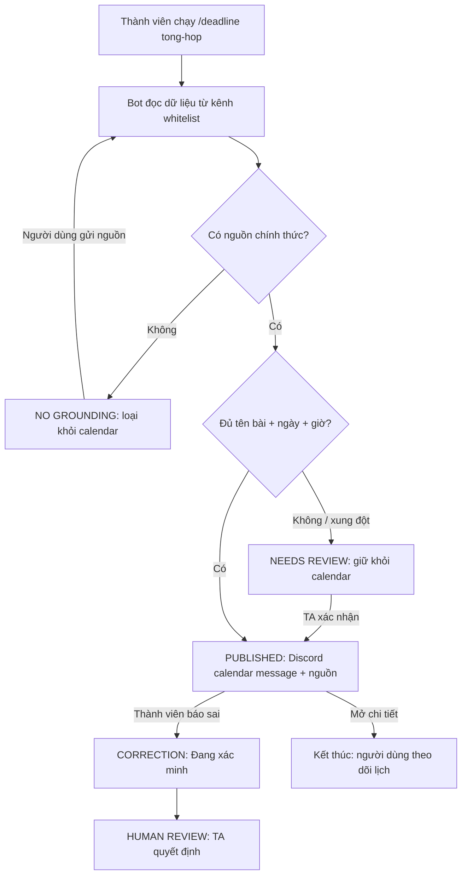

# AI SPEC — Discord Deadline Hub & Calendar · Nhóm Trustmebro · E403

> **Hướng:** [x] B — Trợ lý Học viên (Discord)  
> **Loại:** [x] Tối ưu tính năng có sẵn  
> **Lát cắt:** *Nhiều kênh thông báo → Một quyết định AI có căn cứ → Một lịch deadline chung dễ theo dõi.*

---

## §1. User & Job

* **Job Executor:** Học viên các khóa học AI / Công nghệ đang thực hiện Lab, Quiz, Assignment và Capstone Project trên nền tảng Discord (quy mô ~1.000 học viên).
* **Core JTBD:** Theo dõi nhanh và chính xác toàn bộ hạn nộp bài, đường dẫn còn hiệu lực và quy định liên quan tại một kênh/lịch chung mà không phải nhớ thông tin nằm ở kênh nào hoặc lội ngược hàng trăm tin nhắn.
* **Problem Statement:** Deadline trên Discord nằm rải rác giữa nhiều kênh và nhanh chóng bị trôi; cách hỏi bot từng lần vẫn buộc người học phải chủ động nhớ mình cần hỏi gì và có thể nhận câu trả lời suy đoán. Thiếu một nơi tổng hợp có căn cứ khiến học viên nộp muộn, sai format hoặc nhầm link cũ, đồng thời tạo gánh nặng hỗ trợ lặp lại lên TA/Mentor.
* **Evidence (Chuẩn A & B):**
  * **Số liệu khảo sát người dùng thực tế ($N = 21$ học viên):**
    * **Hành vi tìm kiếm:** 47.6% (10/21) gõ từ khóa tìm kiếm trên Discord đầu tiên nhưng bị ngợp vì kết quả trả về quá loãng; 14.3% nhắn hỏi bạn bè; 14.3% lội kênh ghim; 14.3% tag bot.
    * **Thời gian tiêu tốn:** 61.9% (13/21) mất từ 5 đến hơn 15 phút để tra cứu, thậm chí không tự tìm ra; chỉ có 19.0% tìm thấy dưới 2 phút.
    * **Độ tin cậy bot cũ:** 52.4% học viên thất bại ở lần gần nhất hỏi bot (33.3% mơ hồ, 9.5% sai hạn/sai link, 9.5% đơ); 61.9% từng trực tiếp gặp sự cố do bot (38.1% đưa sai link, 38.1% bịa quy định barem điểm/XP, 28.6% hướng dẫn sai format).
    * **Hậu quả:** 71.4% chịu ảnh hưởng tiêu cực (33.3% hoang mang phải nhờ người đính chính, 28.6% nộp sát giờ hoặc nộp muộn, 9.5% nộp nhầm file).
  * **Trích dẫn nguyên văn từ học viên:**
    1. *"Hỏi bot thì bot tự chế ra barem điểm không hề có trên lớp làm mình hoảng loạn... Rào cản lớn nhất là thông tin nằm rải rác mỗi nơi một mẩu và không có trang tổng hợp chuẩn xác."*
    2. *"Bot quăng ra một link form đã đóng từ kỳ trước... nộp sát nút chỉ còn đúng 2 phút là đóng cổng."*
    3. *"Công cụ tự động không hiệu quả, học viên buộc phải làm phiền lẫn nhau và làm phiền TA để check thông tin."*
    4. *"Mọi người cho mình hỏi lab 2 hạn mấy giờ nộp thế?"*
    5. *"Bot ơi deadline quiz 1 là hôm nay hay ngày mai?"*

---

## §2. Impact & Quyết định chọn

* **Bảng impact 3 ứng viên tính năng:**
  | Ứng viên tính năng | Số người gặp | Tần suất | Tổn thất mỗi lần | Khả thi build (47.5h) |
  |---|---|---|---|---|
  | **1. Kênh Deadline Hub + Calendar xác thực nguồn** | ~1.000 học viên | Hàng ngày / Mỗi đợt bài | Mất 5-10 điểm bài nộp do trễ hạn / nộp sai form | Rất cao |
  | 2. Bot giải thích code & kiến thức bài giảng | ~600 học viên | 2-3 lần/tuần | Mất 15 phút chờ TA giải đáp | Trung bình |
  | 3. Bot tổng hợp toàn bộ bản tin Discord cuối ngày | 10 TA / Mod | 1 lần/ngày | Tốn 30 phút rà soát tin nhắn tồn | Khá phức tạp |
* **Ứng viên ĐÃ LOẠI:** Ứng viên 2 và bản tin tổng hợp đa chủ đề ở ứng viên 3 vì phạm vi quá rộng, rủi ro ảo giác cao và khó kiểm chứng độ chính xác trong khuôn khổ 47.5 giờ. Tính năng được chọn chỉ tổng hợp các deadline có cấu trúc và nguồn chính thức.
* **Ứng viên ĐÃ CHỌN:** Ứng viên 1 vì giải quyết trực tiếp rủi ro học viên bị 0 điểm, chi phí sai sót (cost-of-error) cao nhất và có bằng chứng định lượng rõ rệt nhất từ khảo sát $N = 21$.

---

## §3. Giải pháp tương tự đã nghiên cứu

* **Discord Forum Bot (Default Search):**
  * *Flow:* Tìm kiếm từ khóa text matching trong server.
  * *Đáng học:* Trích dẫn được link nhảy tới tin nhắn gốc.
  * *Đáng né:* Trả lời sai khi có 2 thông báo cập nhật (ví dụ thông báo gia hạn ghi đè thông báo cũ).
  * *Điểm khác biệt của Trustmebro:* Có một kênh/lịch chung, so sánh timestamp để lấy thông báo mới nhất còn hiệu lực và cho mở lại nguồn từ từng sự kiện.
* **Khanmigo (Khan Academy AI Assistant):**
  * *Flow:* Đối thoại mở có định hướng sư phạm.
  * *Đáng học:* Cơ chế dừng và hỏi lại khi dữ kiện đầu vào chưa đủ.
  * *Đáng né:* Hội thoại dài buộc người học phải chủ động hỏi từng deadline.
  * *Điểm khác biệt của Trustmebro:* Chủ động gom deadline vào lịch trực quan; hội thoại chỉ xuất hiện khi cần con người xác nhận ngoại lệ.

---

## §4. Thiết kế Lát Cắt & HAX/PAIR

* **Lát cắt MỘT CÂU:**  
  > *Một lớp học · có nhiều deadline nằm rải rác ở nhiều kênh Discord · AI bot gom, đối chiếu và hiển thị các hạn có căn cứ trong một kênh `#deadline-hub` kèm lịch chung · thông tin mơ hồ, không có nguồn hoặc bị báo sai sẽ dừng để con người xác nhận.*
* **Giá trị chính:** Người học không phải nhớ deadline nằm ở kênh nào hoặc mở một dashboard bên ngoài. Lệnh `/deadline tong-hop` trả calendar và danh sách hạn ngay trong message của bot trên Discord.
* **Non-goals (Những việc hệ thống KHÔNG làm):**
  1. KHÔNG tự tạo deadline từ tin truyền miệng hoặc nội dung thiếu ngày giờ.
  2. KHÔNG tự thay đổi thông báo gốc, lịch chính thức hoặc quyền nộp bài.
  3. KHÔNG tự gửi DM hay tự nộp bài thay người học.
* **Mức Prototype CP2:** **Working Mock** — mô phỏng Discord client có thể bấm end-to-end. Người dùng chạy slash command, nhận calendar trong bot message, chuyển tháng, mở nguồn, báo sai; admin có thể mở modal thêm deadline thủ công.
* **Phần chạy thật trong CP2:** Hội thoại cuộn độc lập; lệnh `/deadline tong-hop`, `/deadline xem`, `/deadline them`; calendar nằm trong bot message; nút chuyển tháng/chi tiết/đồng bộ; admin modal; bốn nhánh quyết định; correction và decision trace đều chạy thật bằng HTML/CSS/JavaScript.
* **Phần giả lập trong CP2:** Discord Gateway/API, Message Content Intent, Components V2, role permission, model trích xuất JSON, database/audit log và dữ liệu nguồn là mock. Prototype không gửi dữ liệu sang Google Calendar hoặc website ngoài.
* **Mức tự động hóa theo cost-of-error:** Chọn **Augment + Conditional automation**. Việc đọc, gộp bản trùng, sắp thứ tự và tạo mục lịch từ nguồn rõ là tác vụ có thể hoàn tác nên được tự động hóa có điều kiện. Việc công bố một hạn mơ hồ, xử lý xung đột và sửa deadline có chi phí sai sót cao (cả lớp có thể nộp trễ), vì vậy hệ thống phải dừng ở `NEEDS REVIEW` để TA giữ quyền quyết định cuối cùng.
* **Ngưỡng hành vi trong prototype:** `đủ tên bài + ngày giờ + nguồn chính thức còn hiệu lực → PUBLISHED`; `thiếu dữ kiện hoặc có xung đột → NEEDS REVIEW`; `không tìm thấy nguồn chính thức → REJECTED / NO GROUNDING`; `người dùng báo sai → HUMAN REVIEW`. Các phần trăm confidence trong CP2 chỉ là nhãn mô phỏng để thể hiện hành vi, không phải số đo mô hình thật.
* **Bảng nguyên tắc HAX/PAIR áp dụng cụ thể trong UI:**

  | Nguyên tắc chính thức | Vị trí áp dụng cụ thể trong prototype | Bằng chứng tương tác |
  |---|---|---|
  | **HAX G1 — Make clear what the system can do** | Tin chào của Deadline Bot và footer calendar nêu bot chỉ đọc 4 kênh whitelist, chỉ công bố khi đủ tên bài/ngày giờ/nguồn. | Thấy trước khi chạy lệnh và lặp lại ngay trong bot message. |
  | **HAX G2 — Make clear how well the system can do what it can do** | Nhãn `3 đã xác thực`, nguồn `%` trên từng deadline, hàng chờ `confidence 46%` và decision trace. | Trạng thái thay đổi theo `AUTO-PUBLISH`, `ADMIN REVIEW`, `REJECTED`. |
  | **HAX G10 — Scope services when in doubt** | Bot giữ “Nộp project trước thứ Sáu” khỏi calendar và đưa nút `Admin kiểm tra`. | Không đoán tên bài/giờ; admin bổ sung bằng modal trước khi công bố. |
  | **HAX G11 — Make clear why the system did what it did** | Nút `Chi tiết` ngay trên từng dòng calendar. | Mở trích đoạn message gốc, kênh nguồn, loại nguồn và confidence. |
  | **HAX G9 — Support efficient correction** + **PAIR Feedback & Control** | Nút `Báo sai` trong chi tiết deadline. | Bot chuyển sang `HUMAN REVIEW`, không tự sửa và giao admin đối chiếu. |

* **Tệp prototype:** [`codebase/index.html`](./codebase/index.html); logic hệ thống tại [`SYSTEM_LOGIC.md`](./SYSTEM_LOGIC.md); hướng dẫn demo tại [`codebase/README.md`](./codebase/README.md).
* **Tài liệu tham chiếu:** [Microsoft HAX Guidelines](https://www.microsoft.com/en-us/haxtoolkit/ai-guidelines/) và [Google PAIR Guidebook](https://pair.withgoogle.com/guidebook-v2/chapters).

---

## §5. Kiểu lỗi — 4 Lớp Chỗ Khó & 8 Kịch Bản Rủi Ro

| # | Tình huống cụ thể | Lớp chỗ khó | Hành vi mong muốn của AI | Nguyên tắc áp dụng |
|---|---|---|---|---|
| 1 | Một thành viên đăng deadline Capstone nhưng không có thông báo chính thức | ① Nguồn sự thật | Không tạo sự kiện; ghi `NO GROUNDING` và cho phép gửi nguồn/nhờ TA. | HAX G1, G2; PAIR Graceful Failure |
| 2 | Có hai thông báo: bản gốc hạn 16/9, bản gia hạn ghi hạn 17/9 | ① Nguồn sự thật | So sánh timestamp, dùng bản mới nhất và hiển thị rõ căn cứ gia hạn trong chi tiết sự kiện. | HAX G11 |
| 3 | Thông báo chỉ ghi *“Nộp project trước thứ Sáu”* | ② Mơ hồ | Không đoán tên bài hoặc giờ; giữ khỏi calendar và chuyển `NEEDS REVIEW`. | HAX G10 |
| 4 | Hai môn có bài cùng tên “Final project” | ② Mơ hồ | Đối chiếu kênh/lớp; nếu vẫn không phân giải được thì yêu cầu TA chọn đúng môn. | HAX G10; PAIR Context |
| 5 | Bot đọc một tin nhắn về điểm danh | ③ Ngoài thẩm quyền | Bỏ qua vì không phải deadline; không biến nội dung ngoài phạm vi thành sự kiện lịch. | HAX G1 |
| 6 | Bot đọc một đoạn code hoặc câu hỏi kiến thức | ③ Ngoài thẩm quyền | Bỏ qua và giữ nguyên phạm vi tổng hợp deadline/logistics có cấu trúc. | HAX G1 |
| 7 | Nguồn thuộc lớp 3B nhưng người xem ở lớp 3A | ④ Domain | Kiểm tra context kênh/lớp; không đưa sự kiện lớp 3B vào calendar lớp 3A. | PAIR Context |
| 8 | Thành viên phát hiện form đã đóng sớm hơn lịch | ④ Domain | Cho báo sai ngay trên sự kiện, chuyển `Đang xác minh` và giao TA quyết định cuối. | HAX G9, G11 |

---

## §6. Bốn Đường Đi Của Trải Nghiệm (4 User Flows)

Prototype cho phép chạy lệnh trong composer Discord và kiểm tra từng nhánh ở bảng **System Logic**. Calendar luôn là một bot message trong `#deadline-hub`, không phải dashboard hoặc tích hợp lịch bên ngoài:

| Luồng | Điểm bắt đầu | Điểm quyết định AI | Phản hồi hệ thống | Điểm kết thúc / quyền kiểm soát |
|---|---|---|---|---|
| **1. Happy path — PUBLISHED** | Thành viên chạy `/deadline tong-hop`; bot đã thu thập thông báo *“Gia hạn Lab 2 đến 23:59 ngày 17/09”* từ kênh whitelist. | Extractor lấy tên bài/ngày giờ; validator xác thực role và nguồn; policy engine đạt 98%, không xung đột. | Bot trả message calendar ngay trong Discord và tạo dòng Lab 2 ngày 17 có nút `Chi tiết`. | Thành viên xem calendar/nguồn mà không rời Discord; message calendar được bot cập nhật khi đồng bộ lại. |
| **2. Low-confidence — NEEDS REVIEW** | Bot gặp tin *“Nộp project trước thứ Sáu”*. | Thiếu tên bài và giờ chốt; không thể nối duy nhất với một assignment; mock confidence 46%. | Không đoán và **không đưa lên calendar**. Tạo một mục `Cần xác nhận` kèm lý do và hành động `Nhờ TA xác nhận`. | TA bổ sung dữ kiện; chỉ khi được xác nhận, deadline mới đủ điều kiện quay về nhánh PUBLISHED. |
| **3. Failure / no-grounding — REJECTED** | Một thành viên đăng *“Nghe nói Capstone nộp Chủ nhật”* nhưng không đính kèm thông báo chính thức. | Bot tìm trong 4 kênh được theo dõi nhưng không thấy nguồn của GV/TA; confidence 0%. | Nêu rõ `Không tìm thấy căn cứ`, không tạo ngày giờ và loại tin khỏi calendar; cung cấp lối `Gửi nguồn chính thức`. | Luồng kết thúc mà không có deadline mới; thành viên có thể cung cấp nguồn hoặc chờ TA, tránh tin đồn trở thành lịch chung. |
| **4. Correction — HUMAN REVIEW** | Thành viên mở `Chi tiết` từ bot calendar và bấm `Báo sai`. | Người dùng chọn loại lỗi; bot gắn nguồn hiện tại vào review ticket. | Deadline chuyển `Đang xác minh`; bot không tự viết đè dữ liệu. | Admin dùng `/deadline duyet` để sửa hoặc khôi phục; audit log giữ cả bản trước/sau. |

**Sơ đồ trạng thái:**

**Tiêu chí nghiệm thu CP2:**

1. `/deadline tong-hop` mô phỏng đọc 4 nguồn và trả calendar ngay trong bot message; `/deadline xem` mở dữ liệu đã lưu; `/deadline them` mở admin modal.
2. Calendar message chuyển tháng được; mỗi deadline mở được căn cứ mà không rời Discord.
3. Cả bốn nút kịch bản tạo đúng `PUBLISHED`, `NEEDS REVIEW`, `NO GROUNDING` và `HUMAN REVIEW`; decision trace thay đổi tương ứng.
4. Correction chuyển deadline sang `HUMAN REVIEW`; admin fallback thêm được deadline có nguồn; bộ đếm coverage đạt `4/4`.

---

## §7. Kiểm Thử & Quality Bar

* **Chiều chất lượng định nghĩa:**
  1. *Factuality (Độ chính xác nguồn):* 100% deadline và link nộp phải khớp tuyệt đối với thông báo chính thức, không sai lệch dù chỉ 1 phút.
  2. *Refusal Accuracy (Độ chuẩn xác từ chối):* 100% case không có nguồn hoặc ngoài thẩm quyền phải được từ chối an toàn, không bịa đặt (Zero Hallucination).
* **Cấu trúc Golden Set CP3 (20 cases, lưu trữ tại `eval/cp3/golden_set_cp3.json`):**
  - 8 cases Normal · 8 cases Hard · 4 cases Rare; phủ 4 lớp chỗ khó (`source_truth`, `ambiguity`, `out_of_authority`, `domain`), ≥10 case có nguồn từ Discord pack kèm `msg_id`.
* **Lượt đo CP3 Run-01 (AI thật qua NVIDIA NIM API, model `deepseek-ai/deepseek-v4-flash-0731`, bằng chứng tại `eval/cp3/RUN-01-REPORT.md` + `run-01.json` + `run-01.csv`): 19 PASS / 1 FAIL, đạt 95%, 0 case bịa/sai deadline** — case FAIL duy nhất: `GS-013` (model trả `REJECTED` thay vì `IGNORED_OUT_OF_SCOPE` vì không có nguồn chính thức trong kênh được phép). Kết quả được giữ nguyên, kể cả case FAIL.
* **Cấu trúc Golden Set CP4 (35 cases + 2 seed ngữ cảnh trong `eval/golden_set.json`, đo bằng `eval/run_eval.py`):**
  - 6 Bẫy căn cứ & Số nhiễu · 6 Mơ hồ & Quy đổi thời gian · 5 Ngoài thẩm quyền & Lọc nhiễu · 6 Đặc thù miền & Phạm vi lớp · 7 Adversarial Zero-Hallucination · 5 Cập nhật đè & Chuỗi đa tin nhắn.
* **Lượt đo CP4 Stress Test (AI thật Gemini 2.5 Flash qua `eval/run_eval.py`, báo cáo tại `eval/run_results.md`): 6/35 PASS = 17.14%, 5 ca bịa/sai deadline (ID 04, 08, 18, 26, 35) → CHƯA ĐẠT Quality Bar.** Kết quả được công khai đầy đủ, không chỉnh sửa để làm đẹp số liệu.
* **Remediation cho 5 ca CP4 chưa đạt (kế hoạch thực hiện trước CP5):**
  1. Ca 04, 18, 26 — Meeting bị trích thành DEADLINE (lấy giờ nhắc/huỷ/record thành hạn nộp): siết prompt extractor phân biệt `start_time` của buổi họp với `deadline` nộp bài; validator đang ép `deadline = None` cho MEETING là đúng hướng, cần thêm kiểm tra giờ họp trùng giờ nhắc.
  2. Ca 08 — `11:59 PM` bị đổi thành `11:59` (AM/PM): bổ sung quy tắc chuẩn hoá giờ 12h trong prompt và test hồi quy.
  3. Ca 35 — mốc cũ (30/09) được chọn thay vì mốc dời sớm (28/09): siết quy tắc "mốc cuối cùng còn hiệu lực" thắng mốc bị huỷ trong cùng tin nhắn.
* **Quality Bar (Chốt từ CP4 — KHÔNG ĐƯỢC SỬA):** **"Đạt khi $\ge 85\%$ test cases vượt qua bộ Golden Set, và $0\%$ case bịa đặt deadline sai."** Không nâng bar lên 95% chỉ vì lượt CP3 đạt 95%. Không sửa Golden Set hoặc kết quả lượt chạy để làm đẹp số liệu.

---

## §8. Phân Công & Kế Hoạch

* **Phân công trách nhiệm:**
  - **Lưu Xuân Dũng (`2A202602746`):** Team Lead · AI Engineer (Prompt, RAG Pipeline & Guardrails).
  - **Trương Thị Lan Anh (`2A202602451`):** System · Prototype (Discord Bot, Webhook & Conditional Flow).
  - **Nguyễn Duy Khánh (`2A202602736`):** Product · UX/UI · Spec (Khảo sát, Output Format, spec.md).
  - **Tạ Quang Dũng (`2A202602588`):** Data · QA · Golden Set (Thu thập log, Test cases, Eval script).
* **Willing Users:** Tối thiểu 2 bạn học viên ngoài nhóm trong phòng E403 xác nhận thử nghiệm tại CP5.

### Tình trạng tại CP4 và phần chưa hoàn thành

- Giao diện Discord trong `codebase/` hiện là Working Mock chạy bằng HTML/CSS/JavaScript.
- AI thật đã được chạy và đo kiểm qua script trong `eval/` (CP3: NVIDIA NIM; CP4: Gemini qua `eval/run_eval.py`), nhưng chưa nối trực tiếp vào giao diện Working Mock.
- Discord Gateway/API, database, webhook, role permission và tích hợp Google Calendar vẫn đang được mô phỏng.
- Lượt stress test CP4 (35 case) hiện CHƯA ĐẠT Quality Bar (17.14%, 5 ca bịa/sai deadline); kế hoạch remediation ghi tại §7, thực hiện trước CP5.
- Chưa thực hiện user validation với người dùng ngoài nhóm; hoạt động này được lên kế hoạch cho CP5.
- Chưa hoàn thành `demo-slides.pdf` và video demo dự phòng cho CP5.
- Log câu trả lời khảo sát chi tiết (N=21) đang do thành viên phụ trách khảo sát lưu giữ, chưa đưa vào repo tại thời điểm CP4 (xem `evidence/survey-method.md`).

### Kế hoạch CP5 và CP6

| Công việc | Người phụ trách | Đầu ra |
|---|---|---|
| Remediation 5 ca stress test CP4 chưa đạt | Tạ Quang Dũng, Lưu Xuân Dũng | Prompt/validator cập nhật + lượt đo lại đạt Quality Bar |
| Thử nghiệm với ≥2 người ngoài nhóm | Nguyễn Duy Khánh | `validation/user_test_log.md` hoàn chỉnh |
| Cập nhật prototype sau user test | Trương Thị Lan Anh | Thay đổi trong `codebase/` và changelog |
| Hoàn thiện slide | Trương Thị Lan Anh, Lưu Xuân Dũng | `demo-slides.pdf` đúng 6 trang |
| Quay video demo dự phòng | Lưu Xuân Dũng | Video chạy được khi mất mạng |
| Kiểm tra eval và số liệu trình bày | Tạ Quang Dũng | Xác minh Run-01 (20 case, 95%) và lượt CP4 so với bar 85% |
| Dry run và chuẩn bị Q&A | Cả nhóm | Đúng thời lượng; mỗi thành viên có phần trình bày |

---

## §9. Changelog

| Thời điểm | Phiên bản | Nội dung thay đổi | Cơ sở / Lý do |
|---|---|---|---|
| 16/9 · 19:30 | v1.0 | Khởi tạo Spec Track B1, chốt Lát cắt 1 câu | Checkpoint 1 |
| 16/9 · 20:00 | v1.1 | Cập nhật phân công vai trò mới, bổ sung số liệu khảo sát $N=21$ | Chuẩn bị Checkpoint 2 |
| 16/9 · CP2 | v2.0 | Dựng lại Working Mock `#deadline-hub` + calendar với 4 luồng; chọn Augment + Conditional theo cost-of-error; chuẩn hóa HAX G1/G2/G9/G10/G11; ghi rõ phần mock/thật | Yêu cầu Checkpoint 2 và thay tính năng hỏi đáp bằng trải nghiệm theo dõi tập trung |
| 17/9 · CP3 | v3.0 | Chạy AI thật trên 20 case: 19 PASS, 1 FAIL, đạt 95%, 0 case bịa deadline | NVIDIA NIM API, model DeepSeek |
| 17/9 · CP4 | v4.0 | Chốt spec 9 phần và khóa Quality Bar ở ≥85%, 0% bịa deadline; công khai các phần chưa hoàn thành; stress test 35 case đạt 17.14% (CHƯA ĐẠT bar) kèm kế hoạch remediation | Hạn chốt spec CP4 |
